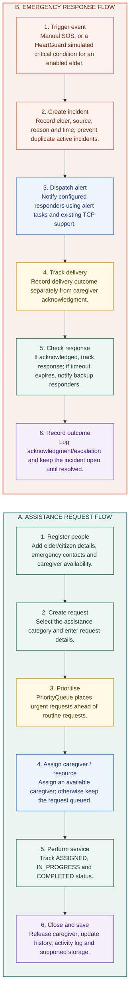

# Workflow Overview

Reference documentation and diagrams for ResQNet and Eldercare emergency assistance and CAD workflows.

For the full specification, see [README.md](./README.md).

```mermaid
flowchart LR
    subgraph FlowA["A. ASSISTANCE REQUEST FLOW"]
        direction TB
        A1["1. Register people
Add elder/citizen details, emergency contacts and caregiver availability."]
        A2["2. Create request
Select the assistance category and enter request details."]
        A3["3. Prioritise
PriorityQueue places urgent requests ahead of routine requests."]
        A4["4. Assign caregiver / resource
Assign an available caregiver; otherwise keep the request queued."]
        A5["5. Perform service
Track ASSIGNED, IN_PROGRESS and COMPLETED status."]
        A6["6. Close and save
Release caregiver; update history, activity log and supported storage."]
        A1 --> A2 --> A3 --> A4 --> A5 --> A6
    end

    subgraph FlowB["B. EMERGENCY RESPONSE FLOW"]
        direction TB
        B1["1. Trigger event
Manual SOS, or a HeartGuard simulated critical condition for an enabled elder."]
        B2["2. Create incident
Record elder, source, reason and time; prevent duplicate active incidents."]
        B3["3. Dispatch alert
Notify configured responders using alert tasks and existing TCP support."]
        B4["4. Track delivery
Record delivery outcome separately from caregiver acknowledgment."]
        B5["5. Check response
If acknowledged, track response; if timeout expires, notify backup responders."]
        B6["6. Record outcome
Log acknowledgment/escalation and keep the incident open until resolved."]
        B1 --> B2 --> B3 --> B4 --> B5 --> B6
    end

    style FlowA fill:#EAF5F2,stroke:#2D7D75,stroke-width:2px,color:#134E48
    style FlowB fill:#FAF0EB,stroke:#C05C3D,stroke-width:2px,color:#7C2D12
    style A1 fill:#EDF7F4,stroke:#3B7A57,stroke-width:1.5px,color:#1B4332
    style A2 fill:#EDF7F4,stroke:#3B7A57,stroke-width:1.5px,color:#1B4332
    style A3 fill:#FFF9E6,stroke:#D4A017,stroke-width:1.5px,color:#5A4300
    style A4 fill:#EEF4FC,stroke:#3B82F6,stroke-width:1.5px,color:#1E3A8A
    style A5 fill:#EDF7F4,stroke:#3B7A57,stroke-width:1.5px,color:#1B4332
    style A6 fill:#F5EFFB,stroke:#8B5CF6,stroke-width:1.5px,color:#4C1D95
    style B1 fill:#FDF2EE,stroke:#E06D53,stroke-width:1.5px,color:#7C2D12
    style B2 fill:#FDF2EE,stroke:#E06D53,stroke-width:1.5px,color:#7C2D12
    style B3 fill:#EEF4FC,stroke:#3B82F6,stroke-width:1.5px,color:#1E3A8A
    style B4 fill:#FFF9E6,stroke:#D4A017,stroke-width:1.5px,color:#5A4300
    style B5 fill:#EDF7F4,stroke:#3B7A57,stroke-width:1.5px,color:#1B4332
    style B6 fill:#F5EFFB,stroke:#8B5CF6,stroke-width:1.5px,color:#4C1D95
```

